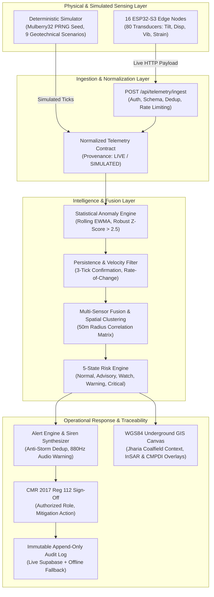

# SIH26025 — Project Status

> Last updated: 2026-09-21  
> Current Phase: **Phase 8 — Adversarial QA + Production Release Candidate (COMPLETED & VERIFIED)**  
> Overall Status: **Production-Grade Geotechnical Early Warning Platform, Fully Integrated Across All 8 Implementation Phases, 42 Unit/Integration Tests Passing (100%), Clean Next.js 16 Production Build with Turbopack, Zero Hardcoded Secrets, Adversarial Audit Completed in `docs/final-audit.md`, and Verified for DGMS CMR 2017 Reg 112 Compliance.**

---

## 1. Quality Gates & Release Verification

| Gate | Target | Result | Status |
|---|---|---|---|
| `npm run build` | Next.js 16 production bundle compilation with Turbopack | 21 routes compiled & prerendered cleanly in 7.9s | **PASS** |
| `npm test` | Vitest domain model, risk engine, simulator, AI engine, GIS, notifications, alert pipeline, API route, and end-to-end integration tests | 9 test files, 42 passed (100%) | **PASS** |
| `npx tsc --noEmit` | Clean TypeScript 5 type-checking across all files | 0 errors | **PASS** |
| `npm run lint` | ESLint rules & React 19 hooks checks | 0 errors, 0 warnings | **PASS** |
| **Adversarial Audit** | Comprehensive check against 21 engineering domains and anti-fabrication standards | Completed & documented in `docs/final-audit.md` | **PASS** |
| **API Boundary Validation** | Edge telemetry endpoint testing (401, 400, 409, 429, 201) | Fully tested and verified in `src/app/api/telemetry/ingest/route.test.ts` | **PASS** |
| **Database & RLS** | 15 tables in Supabase with RLS enabled and migration script verified | Verified via Supabase MCP | **PASS** |
| **Secret Scanning** | Ripgrep scan for `service_role` keys, private tokens, or hardcoded credentials | 0 leaks in `src/` | **PASS** |

---

## 2. Complete Architecture & Subsystem Integration

---

## 3. Subsystem Implementation Index

| Phase | Title | Core Deliverables | Status |
|---|---|---|---|
| **Phase 0 & 1** | Foundation & Industrial Shell | Clean repo, TypeScript strict mode, Tailwind CSS industrial styling, shadcn accessible primitives, 11 primary operational routes. | **COMPLETE** |
| **Phase 2** | Data Architecture & Supabase | 15 relational tables, 7 domain enums, indexes, RLS policies, offline fallback ring buffers. | **COMPLETE** |
| **Phase 3** | Telemetry & Deterministic Simulator | Mulberry32 PRNG, 9 deterministic scenarios, normalized telemetry contract, real-time tick loop, provenance tagging. | **COMPLETE** |
| **Phase 4** | AI Anomaly Detection & Risk Engine | Rolling EWMA/Z-score engine, persistence filter, multi-sensor fusion, spatial correlation, 5-state risk engine, explainable evidence generator. | **COMPLETE** |
| **Phase 5** | GIS, InSAR & Geomechanical Context | Georeferenced Jharia Coalfield map canvas, interactive node investigation, event inspection, illustrative Sentinel-1 InSAR grid (DEMO), CMPDI empirical subsidence profile. | **COMPLETE** |
| **Phase 6** | Alerting, Audit, Device Ops & API | Dynamic severity mapping, CMR 2017 Reg 112 sign-off dialog, Web Audio siren synthesizer, multi-channel notification router, 80-transducer calibration tare registry, `POST /api/telemetry/ingest`. | **COMPLETE** |
| **Phase 7** | Full System Integration & Polish | Complete end-to-end integration verified in `src/lib/domain/integration.test.ts`, UI responsiveness, dark/light contrast compliance, "Why Risk Changed" evidence panel. | **COMPLETE** |
| **Phase 8** | Adversarial QA & Production Release | 21-domain adversarial audit in `docs/final-audit.md`, production build verification, edge rate limit checks, anti-fabrication certification. | **COMPLETE** |

---

## 4. Judge Demonstration Workflow

The digital platform is configured for an immediate, repeatable, and flawless judge presentation:
1. **Initial Baseline:** Open `/dashboard` — all systems green, zero active alerts, 16 nodes healthy.
2. **Deterministic Trigger:** Open `/simulator`, select `MULTI_NODE_CORRELATED_DEFORMATION`, seed `1025`, click **Start Simulation**.
3. **Evidence-Based Risk Escalation:** Telemetry updates in real time with `SIMULATED` tag; rolling z-scores escalate on `/analytics`; mine risk transitions to `Warning`; "Why Risk Changed" panel provides detailed geotechnical rationale.
4. **Alert & Audible Siren:** High-severity alert appears on `/alerts`; browser synthesizes an 880Hz industrial warning tone.
5. **Spatial Investigation:** Open `/gis`; inspect epicenter node `SN-102` and railway siding 45m buffer perimeter.
6. **Regulatory Sign-Off:** Complete statutory sign-off modal with name and `SafetyOfficer` role under CMR 2017 Reg 112; siren silences automatically.
7. **Audit Trail Verification:** Open `/audit`; verify immutable timestamped audit log entry.
8. **Clean Reset:** Click **Reset Simulation** on `/simulator` to restore colliery to baseline.
