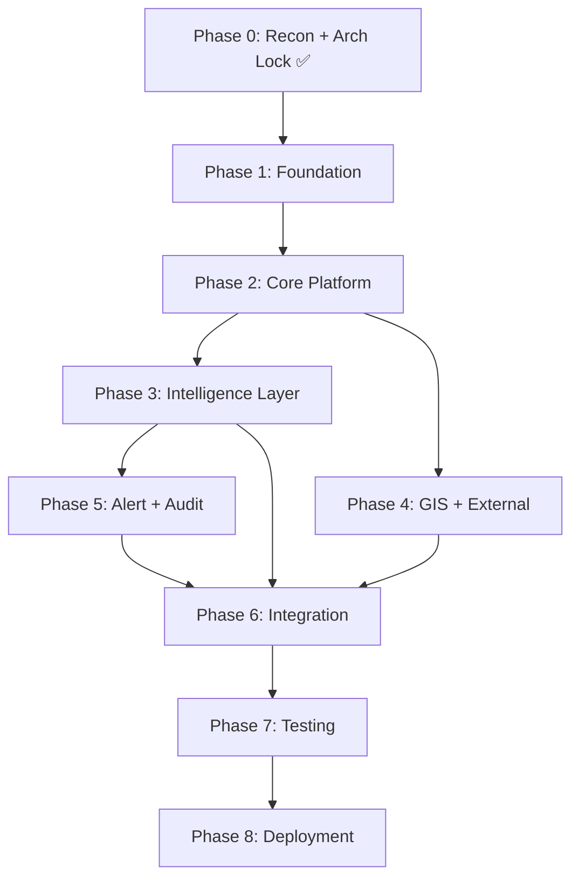

# SIH26025 — Software Roadmap

> Version: 1.0 (Phase 0 Lock)  
> Date: 2026-09-20

---

## Phase Overview

| Phase | Name | Status | Dependencies |
|---|---|---|---|
| **0** | Reconnaissance + Architecture Lock | ✅ Complete | None |
| **1** | Foundation | 🔲 Not started | Phase 0 |
| **2** | Core Platform | 🔲 Not started | Phase 1 |
| **3** | Intelligence Layer | 🔲 Not started | Phase 2 |
| **4** | GIS + External Context | 🔲 Not started | Phase 2 |
| **5** | Alert + Audit System | 🔲 Not started | Phase 3 |
| **6** | Integration + Polish | 🔲 Not started | Phases 3, 4, 5 |
| **7** | Testing + Verification | 🔲 Not started | Phase 6 |
| **8** | Deployment + Release | 🔲 Not started | Phase 7 |

---

## Phase 1: Foundation

### Objective
Establish a working development environment, initialise all tooling, create the Supabase project, and define the core domain types and database schema.

### Deliverables

| # | Deliverable | Detail |
|---|---|---|
| 1.1 | Git initialisation | `git init`, initial commit, GitHub remote |
| 1.2 | Clean npm install | Delete `node_modules`, `npm install`, commit `package-lock.json` |
| 1.3 | Environment configuration | `.env.example`, `.env.local` with Supabase placeholders |
| 1.4 | Supabase project creation | New project in ap-south-1, save credentials |
| 1.5 | Database schema | Migrations for all core entities (mines, panels, nodes, sensors, telemetry, anomalies, risk, alerts, audit, users) |
| 1.6 | Row Level Security | RLS policies on all data tables |
| 1.7 | Domain types | TypeScript types/interfaces in `src/lib/domain/` |
| 1.8 | Supabase client utilities | Server + browser clients, middleware helper |
| 1.9 | shadcn/ui initialisation | `npx shadcn@latest init`, core component set |
| 1.10 | Vitest setup | `vitest.config.ts`, setup file, first passing test |
| 1.11 | Auth scaffolding | Login page, auth middleware, role types |
| 1.12 | Application shell | Sidebar layout, navigation, demo mode indicator |

### Dependencies
- Phase 0 architecture must be approved

### Exit Criteria
- `npm run build` passes
- `npm run lint` passes
- `npm test` runs (at least domain type tests)
- Supabase project active with schema applied
- Auth login/logout works
- Application shell renders with navigation

---

## Phase 2: Core Platform

### Objective
Build the operational dashboard, telemetry display, sensor node management, and simulator engine.

### Deliverables

| # | Deliverable | Detail |
|---|---|---|
| 2.1 | Telemetry adapter interface | `TelemetryAdapter` abstraction |
| 2.2 | Simulator engine | Seeded PRNG, scenario library, deterministic output |
| 2.3 | Simulator UI controls | Start/pause/reset/speed/scenario/seed/node selection |
| 2.4 | Telemetry ingestion API | API route for receiving samples → database |
| 2.5 | Dashboard overview | Key metrics, system status, active alerts count, node health summary |
| 2.6 | Telemetry page | Real-time charts for selected node/sensor, time-range selection |
| 2.7 | Node management page | Node list, health status, sensor inventory, click-to-inspect |
| 2.8 | Historical analysis | Time-series query and display for past data |
| 2.9 | Supabase Realtime | Live subscription for telemetry updates on dashboard |
| 2.10 | Data provenance display | Provenance indicators on all data views |

### Dependencies
- Phase 1 complete (schema, auth, shell, types)

### Exit Criteria
- Simulator produces deterministic data (same seed = same output)
- Telemetry data flows: simulator → API → database → Realtime → UI
- Charts display live updating sensor readings
- Node page shows health and sensor status
- Demo mode clearly indicated in UI

---

## Phase 3: Intelligence Layer

### Objective
Implement the anomaly detection pipeline, risk assessment engine, sensor fusion, and spatial correlation.

### Deliverables

| # | Deliverable | Detail |
|---|---|---|
| 3.1 | Preprocessing | Validation, NaN handling, unit normalisation |
| 3.2 | Baseline analysis | Rolling mean/std establishment |
| 3.3 | Feature extraction | Z-score, rate-of-change, EWMA deviation |
| 3.4 | Statistical anomaly detection | Threshold-based detection with configurable sensitivity |
| 3.5 | Isolation Forest | `@kanaries/ml` integration, multivariate detection |
| 3.6 | Persistence analysis | Duration tracking, sustained vs. transient classification |
| 3.7 | Sensor fusion | Cross-modal correlation within a node |
| 3.8 | Spatial correlation | Cross-node agreement analysis |
| 3.9 | Risk assessment | Weighted scoring → Normal/Advisory/Watch/Warning/Critical |
| 3.10 | Explanation generation | Human-readable rationale for each risk decision |
| 3.11 | Analytics page | Anomaly timeline, detection evidence, risk progression chart |

### Dependencies
- Phase 2 complete (telemetry pipeline, simulator, charts)

### Exit Criteria
- Simulator scenario triggers anomaly detection
- Risk state transitions are explainable
- Transient disturbance does NOT escalate to Critical
- Sustained correlated anomaly DOES escalate appropriately
- Explanations are human-readable and include contributing sensors
- Unit tests pass for all AI pipeline components

---

## Phase 4: GIS + External Context

### Objective
Implement the interactive GIS map, demo mine layout, and external observation layers.

### Deliverables

| # | Deliverable | Detail |
|---|---|---|
| 4.1 | MapLibre integration | react-map-gl setup, free tile source |
| 4.2 | Demo mine GeoJSON | Fictional mine boundary, panels, node locations |
| 4.3 | Node markers | Risk-state coded markers with health indicators |
| 4.4 | Click-to-inspect | Node selection → telemetry/risk/alert panel |
| 4.5 | Event clusters | Anomaly event display on map |
| 4.6 | InSAR overlay | SIMULATED surface deformation layer (clearly labelled) |
| 4.7 | Geomechanical reference | ILLUSTRATIVE boundary overlay (clearly labelled) |
| 4.8 | Filters | Time range, risk state, node type, sensor type |
| 4.9 | Accessibility | Non-colour risk indicators, keyboard navigation |

### Dependencies
- Phase 2 complete (nodes, telemetry)
- Phase 3 desirable (risk states) but can start concurrently

### Exit Criteria
- Map renders with demo mine layout
- Nodes display with correct risk-state colours + pattern indicators
- Clicking a node shows its telemetry and risk info
- InSAR layer is clearly labelled SIMULATED
- Geomechanical reference is clearly labelled ILLUSTRATIVE
- Map is keyboard accessible

---

## Phase 5: Alert + Audit System

### Objective
Implement the alert lifecycle (creation → notification → acknowledgement → escalation → audit) and the audit log.

### Deliverables

| # | Deliverable | Detail |
|---|---|---|
| 5.1 | Alert policy engine | Configurable thresholds and conditions |
| 5.2 | Alert creation | Risk assessment → alert generation with evidence |
| 5.3 | In-app notifications | Alert panel, badge count, toast notifications |
| 5.4 | Browser audio alarm | Configurable audible alert for Warning/Critical |
| 5.5 | Visual warning banner | Persistent banner for active Critical alerts |
| 5.6 | Alert page | Alert list, filtering, detail view with evidence |
| 5.7 | Alert acknowledgement | Operator can acknowledge with notes |
| 5.8 | Alert escalation | Time-based escalation for unacknowledged alerts |
| 5.9 | External notifications | Optional email/SMS/webhook (graceful degradation) |
| 5.10 | Audit log system | Append-only audit entries for all significant events |
| 5.11 | Audit page | Searchable, filterable audit trail |
| 5.12 | Alert + audit export | CSV/JSON export |

### Dependencies
- Phase 3 complete (risk assessment drives alerts)

### Exit Criteria
- Risk state change triggers alert
- Alert contains WHAT/WHERE/WHEN/WHY/EVIDENCE/STATE/ACTION
- Operator can acknowledge alerts
- Unacknowledged alerts escalate
- Audit trail records all alert lifecycle events
- In-app mechanisms work without external credentials
- External integrations fail gracefully

---

## Phase 6: Integration + Polish

### Objective
End-to-end integration testing, UI polish, loading/error/empty states, responsive layout, and demo flow rehearsal.

### Deliverables

| # | Deliverable | Detail |
|---|---|---|
| 6.1 | End-to-end demo flow | Full scenario: healthy → event → anomaly → risk → alert → acknowledge → audit → reset |
| 6.2 | Loading states | Skeleton/spinner for all data-dependent views |
| 6.3 | Error states | Error boundaries, API error handling, offline indicators |
| 6.4 | Empty states | Meaningful empty state messages for all list/chart views |
| 6.5 | Responsive layout | Desktop, laptop, tablet widths |
| 6.6 | Settings page | Demo/live mode toggle, simulation config, user preferences |
| 6.7 | System health page | Node health summary, database connectivity, realtime status |
| 6.8 | Reports | Dashboard metrics export, alert history, audit export |
| 6.9 | UI consistency pass | Typography, spacing, colour usage, risk state consistency |

### Dependencies
- Phases 2–5 complete

### Exit Criteria
- Full demo scenario works end-to-end without errors
- All pages handle loading, error, and empty states
- Responsive layout works on desktop and tablet
- Risk state terminology is consistent everywhere
- Data provenance is visible on all data views

---

## Phase 7: Testing + Verification

### Objective
Comprehensive testing, accessibility audit, performance check, security review, and adversarial claim audit.

### Deliverables

| # | Deliverable | Detail |
|---|---|---|
| 7.1 | Unit tests | Domain logic, AI pipeline, risk engine, simulator |
| 7.2 | Integration tests | API routes, database operations, auth flows |
| 7.3 | Component tests | Key UI components with React Testing Library |
| 7.4 | Build verification | `npm run build` passes cleanly |
| 7.5 | Browser verification | Chrome DevTools: console errors, responsive, accessibility |
| 7.6 | Accessibility audit | Keyboard nav, ARIA, contrast, focus states |
| 7.7 | Security review | RLS verification, auth bypass attempts, secret exposure check |
| 7.8 | Claim audit | Review ALL UI text for unsupported scientific claims |
| 7.9 | Performance check | Dashboard load time, chart rendering, realtime latency |

### Dependencies
- Phase 6 complete

### Exit Criteria
- All tests pass
- Build passes
- No console errors
- No unsupported claims in UI
- Accessibility checklist passes
- No secrets in committed code

---

## Phase 8: Deployment + Release

### Objective
Deploy to Vercel, verify production, prepare documentation, and finalise for SIH evaluation.

### Deliverables

| # | Deliverable | Detail |
|---|---|---|
| 8.1 | GitHub push | Clean repo, README, .env.example, docs, no secrets |
| 8.2 | Vercel deployment | Connect repo, configure env vars, verify build |
| 8.3 | Production verification | Test deployed application end-to-end |
| 8.4 | Demo script | Written script for SIH judge demonstration |
| 8.5 | Documentation | Architecture, API docs, limitations, known issues |
| 8.6 | Final adversarial audit | Claude audit of entire system before presentation |

### Dependencies
- Phase 7 complete

### Exit Criteria
- Application is live on Vercel
- Demo scenario works on production
- Documentation is complete and honest
- No critical or high risks unresolved

---

## Dependency Graph



**Critical path**: P0 → P1 → P2 → P3 → P5 → P6 → P7 → P8

Phase 4 (GIS) can run partially concurrent with Phase 3 since it depends primarily on Phase 2 outputs (nodes, telemetry) rather than the full intelligence layer.

---

## Demo Path

The complete judge demonstration scenario:

```
1. Application loads → dashboard shows DEMO mode indicator
2. Navigate to Simulator → select "escalating-multi-modal" scenario
3. Set seed (e.g., 42) → Start simulation
4. Dashboard shows telemetry updating in real time
5. After ~30s simulated time: Advisory risk state appears
6. Telemetry page: observe deviation on affected sensors
7. GIS map: affected nodes change colour/pattern
8. After ~60s: Watch → Warning progression
9. Risk assessment shows explainable evidence
10. Alert generated → notification appears
11. Alert page: view WHAT/WHERE/WHEN/WHY/EVIDENCE
12. Acknowledge alert with operator notes
13. Audit page: verify complete event trail
14. Reset simulation → system returns to Normal
15. Repeat with different scenario/seed → different but deterministic output
```

Every step is verifiable. Every data point is traceable. Every claim is defensible.
